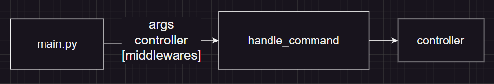

# Contributing to project

## How to setup dev env?

## Project structure

## Flow

## How to add new CLI command?

## How to add new test case criteria?

## Need help?

### CLI
<!-- gaurang98671(Gaurang pawar) -->

  
  <a href="https://github.com/gaurang98671" style="margin-left: 10px; font-size: 19">Gaurang Pawar</a>

### Testing Functionality
<!-- gaurang98671(Gaurang pawar) -->

  
  <a href="https://github.com/gaurang98671" style="margin-left: 10px; font-size: 19">Gaurang Pawar</a>

### Core Math Functions

<!-- gaurang98671(Gaurang pawar) -->

  
  <a href="https://github.com/gaurang98671" style="margin-left: 10px; font-size: 19">Gaurang Pawar</a>

### Documentation
<!-- gaurang98671(Gaurang pawar) -->

  
  <a href="https://github.com/gaurang98671" style="margin-left: 10px; font-size: 19">Gaurang Pawar</a>

