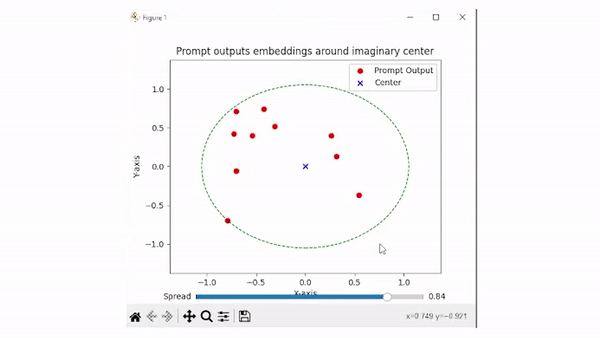

# Criteria

## Spread


## Compare
```compare``` requires 2 sub-pdarameters 
```

```

## Time
```time``` will check average time in seconds for each response for n calls. Following is an example manifest.
```
check_time:
  - name: Test prompt to check time
    prompts:
      - name: Test prompt to check time
        calls: 10
        temperature: 0.6
        prompt:
          text: Write me a 500-word college essay.
        time: 5
```

## Regex
```regex``` criteria checks prompt outputs with a regular expression. Here is an example manifest for checking regex.
```regex_check:
  - name: Regex check prompt
    prompts:
      - name: Check regex
        calls: 2
        temperature: 0
        prompt:
          text: Return '<>' character as response. Only return mentioned characters and nothing else.
        regex: "<>"

```

## Tokens
